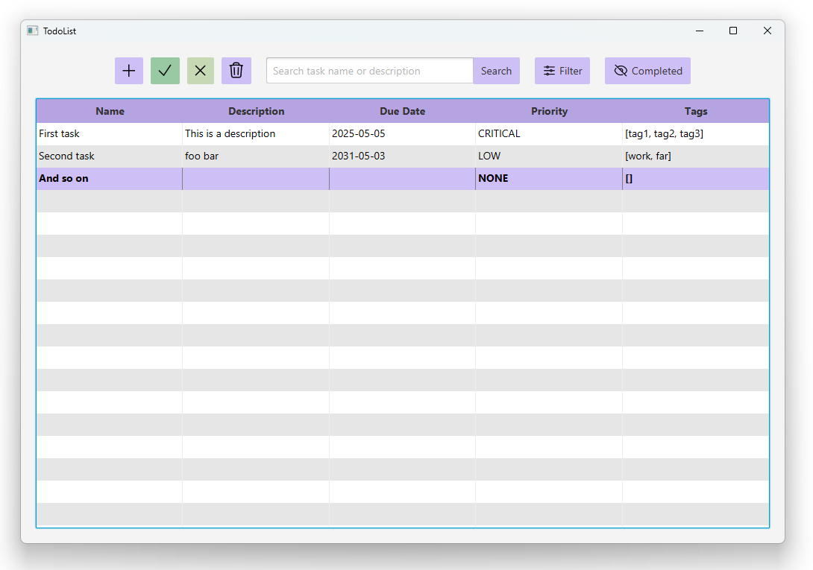
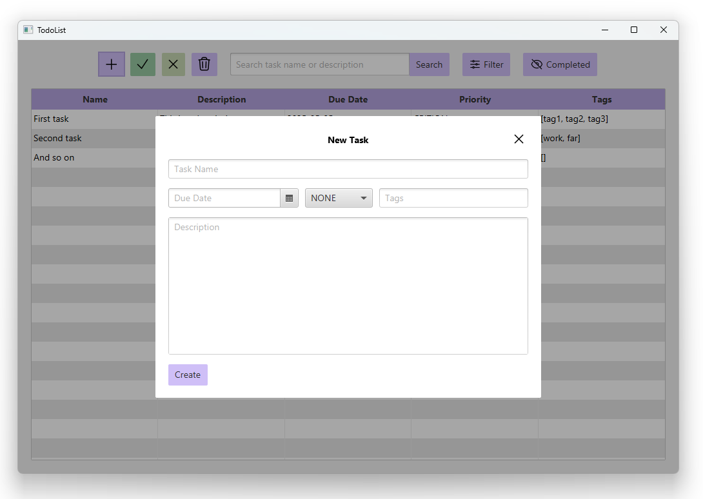

<h1 align="center">Todolist</h1>

<h4 align="center">A rite of passage, a to-do list app.</h4>

<h4 align="center">
    <a href="#preview"><b>Preview</b></a> •
    <a href="#features"><b>Features</b></a>
</h4>

<h2 id="preview">Preview</h2>

<h2 id="features">Features</h2>
- Trackable task information
  - Name
  - Description
  - Due Date
  - Priority
  - Tags
- Search for tasks by name or description
- Show/Hide completed tasks
- SQLite Storage
